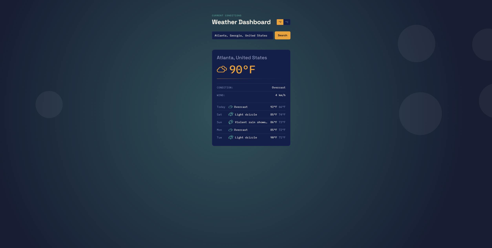

# Weather Dashboard

A lightweight, animated weather web app built with plain HTML, CSS, and JavaScript. It lets users search for a city, view the current weather conditions, switch between Fahrenheit and Celsius, and review a 5-day forecast.

## Project URL

https://xterminator101.github.io/Weather-Dashboard/

## What the project does

Weather Dashboard is a browser-based UI for checking live weather forecasts. It uses the Open-Meteo geocoding and forecast APIs to look up a location and display current atmospheric data in a polished, responsive card layout.

## Why the project is useful

This project is useful for developers and learners who want a clean example of a small front-end app that:

- retrieves live weather data from a public API
- uses JavaScript to render dynamic UI content
- supports city autocomplete suggestions
- adapts the page theme to the current weather mood
- runs without a framework or package install step

### Key features

- City search with live suggestions
- Current temperature, weather condition, and wind speed
- 5-day forecast display
- Unit toggle between °F and °C
- Animated background and weather-themed visuals
- No build tooling required

## Preview



## Getting started

### Prerequisites

- A modern browser with internet access
- Python 3.x for the simplest local static server option, or any other static file server

### Quick start

1. Clone or download the repository.
2. Navigate to the project folder.
3. Start a simple local server:

```bash
python -m http.server 8000
```

4. Open the app in your browser:

```text
http://localhost:8000
```

You can also open [index.html](index.html) directly in a browser, though a local server is recommended for a smoother static-site workflow.

### Usage

1. Type a city name in the search field.
2. Choose a matching location from the suggestion list.
3. Review the current weather and forecast card.
4. Use the temperature toggle to switch between Fahrenheit and Celsius.

## Project structure

- [index.html](index.html) – page structure and UI containers
- [style.css](style.css) – layout, visual design, and animation styling
- [script.js](script.js) – fetch logic, autocomplete, rendering, and dynamic mood effects

## Support and documentation

For external API details, refer to the Open-Meteo documentation:

- [Open-Meteo Geocoding API](https://open-meteo.com/en/docs/geocoding-api)
- [Open-Meteo Forecast API](https://open-meteo.com/en/docs)

If you run into an issue while using or extending the app, open an issue in the repository or contact the project maintainer through the repo's configured communication channel.

## Maintainer and contribution

This project is maintained by its current repository author. Contributions are welcome via pull requests or issue reports.

### Contribution workflow

1. Fork the repository.
2. Create a small, focused feature branch.
3. Make your changes and keep the project style consistent.
4. Test the app in a browser and verify the updated behavior.
5. Open a pull request with a clear description of the change.

### Contribution guidelines

- Keep changes minimal and easy to review
- Preserve the existing plain HTML/CSS/JavaScript approach unless a broader refactor is needed
- Prefer readable, well-documented code
- Verify that the app still works in a browser after your changes

## What I Learned

While building this project, I practiced:

- Working with REST APIs
- Fetching asynchronous data using `fetch()`
- DOM manipulation
- Event handling
- Debouncing user input
- Responsive web design
- Error handling
- Organizing JavaScript into reusable function

## Notes

This app has no package dependencies and does not require a build step. It depends on internet access to retrieve live weather information from Open-Meteo.
